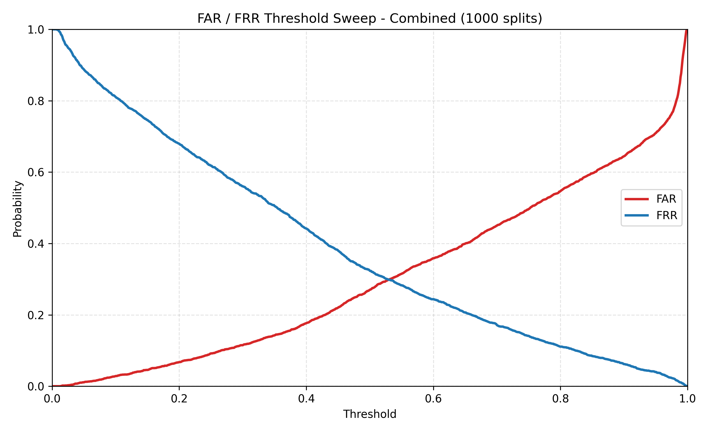

# FAR-FRR Graph for UCF

# Project Files
所有結果皆在 `results/` 資料夾中。

# 真假分數
本專題設定
- 分數 0 為 **真**
- 分數 1 為 **假**

# Average Inference Time for UCF
|Dataset|Time(ms)|
|----           |----   |
|CelebDF        |166.85     |
|DFDC           |170.81     |
|FaceForensics  |224.81     |
|Combined(Micro)       |199.42    |
|Combined(Macro)       |176.84     |

- **Micro**：每個類別平均時間的平均
- **Macro**：所有測試的平均時間

# FAR、FRR Chart

| Threshold | FAR | FRR |
|---- |---- |---- |
| 0.05 | 0.010946 | 0.887581 |
| 0.1 | 0.02858 | 0.810482 |
| 0.15 | 0.045607 | 0.745917 |
| 0.2 | 0.067498 | 0.679453 |
| 0.25 | 0.091821 | 0.617926 |
| 0.3 | 0.114929 | 0.560197 |
| 0.35 | 0.142597 | 0.505127 |
| 0.4 | 0.176649 | 0.441701 |
| 0.45 | 0.220128 | 0.380175 |
| 0.5 | 0.270295 | 0.323585 |
| 0.55 | 0.314989 | 0.282947 |
| 0.6 | 0.358468 | 0.243828 |
| 0.65 | 0.399514 | 0.206608 |
| 0.7 | 0.449985 | 0.171288 |
| 0.75 | 0.496503 | 0.140904 |
| 0.8 | 0.546671 | 0.1109 |
| 0.85 | 0.596534 | 0.084314 |
| 0.9 | 0.644573 | 0.061907 |
| 0.95 | 0.709334 | 0.039878 |
| 1 | 1.0 | 0.0 |

# EER (FAR == FRR)
|Dataset            |Threshold  |FAR        |FRR        | 
|----               |----       |----       |----       |
|CelebDF            |0.463      |0.294118   |0.297753   |
|DFDC               |0.509      |0.329427   |0.330022   |
|FaceForensics      |0.79       |0.051786   |0.05       |
|Combined           |0.530     |0.298875    |0.298519   |